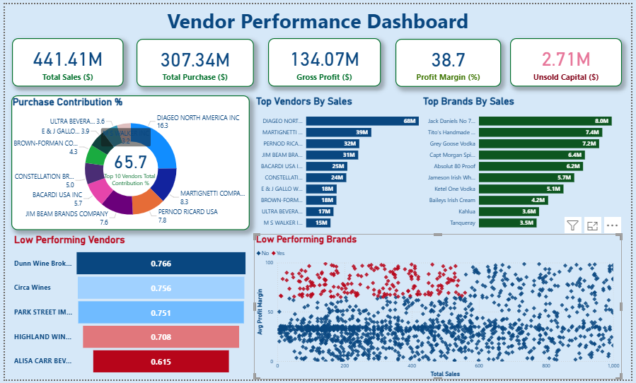

# Vendor Performance Data Analytics

Designed and implemented a complete analytics pipeline leveraging SQL, Python, and Power BI to evaluate and monitor vendor performance across multiple dimensions. Conducted extensive data cleaning of invoice, purchase, and sales data to ensure accuracy and consistency for analysis. Defined and developed key business KPIs including gross profit, profit margin, sales-to-purchase ratio to measure financial efficiency. Built interactive Power BI dashboards that provided stakeholders with real-time visibility into vendor performance, enabling data-driven decision-making.

---

## 📊 Power BI Dashboard



*The dashboard provides real-time insights into total sales, purchases, gross profit, profit margin, unsold capital, vendor and brand rankings, and highlights low-performing vendors and brands.*

---

## 🔑 Key Features & KPIs
- Data ingestion from CSV files to SQLite database
- Data cleaning and transformation for accuracy
- Vendor-wise sales and purchase summary
- Calculation of KPIs: Gross Profit, Profit Margin, Sales-to-Purchase Ratio, Stock Turnover, Unsold Capital
- Interactive Power BI dashboard for visualization
- Identification of top and low-performing vendors and brands

---

## 📁 Project Structure
```
Vendor Project/
│
├── Exploratory Data Analysis.ipynb
├── Vendor Performance Analysis.ipynb
├── get_vendor_summary.py
├── ingestion_db.py
├── Vendor Performance Report.pdf
├── vendor_performance.pbix
├── vendor_sales_summary.csv
├── README.md
├── data/
│   ├── begin_inventory.csv
│   ├── end_inventory.csv
│   ├── purchase_prices.csv
│   ├── purchases.csv
│   ├── sales.csv
│   └── vendor_invoice.csv
```

---

## 🚀 Usage Instructions

### 1. Clone the Repository
```powershell
git clone https://github.com/Yasvi-Kachhadiya/Vendor-Performance-Data-Analytics.git
```

### 2. Install Python Dependencies
- Ensure you have Python 3.x installed.
- Install required packages:
```powershell
pip install pandas sqlalchemy matplotlib seaborn
```

### 3. Ingest Data into SQLite Database
- Run the ingestion script to load CSV files into the database:
```powershell
python ingestion_db.py
```

### 4. Generate Vendor Summary Table
- Run the summary script:
```powershell
python get_vendor_summary.py
```

### 5. Perform Data Analysis
- Open and run the Jupyter notebooks:
  - `Exploratory Data Analysis.ipynb`
  - `Vendor Performance Analysis.ipynb`

### 6. View Power BI Dashboard
- Open `vendor_performance.pbix` in Power BI Desktop to explore interactive visualizations.

---

## 📬 Contact
For more updates or queries, connect with me on [LinkedIn](https://www.linkedin.com/).
